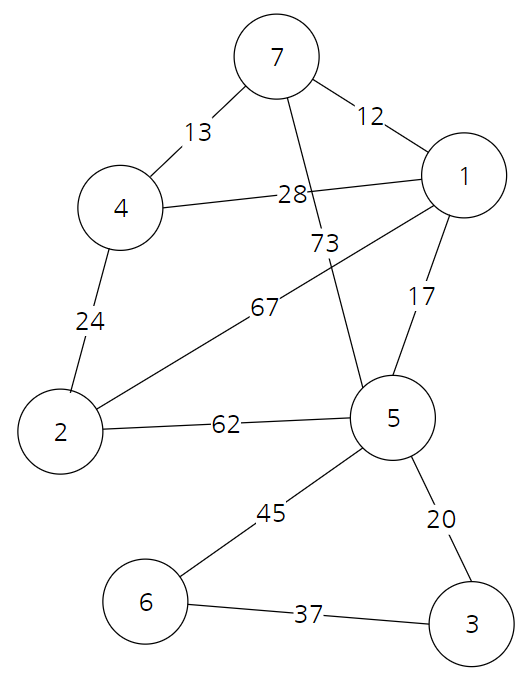
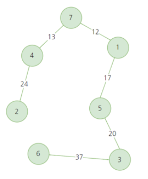

# Kruskal Algorithm

> <a src="https://youtu.be/LQ3JHknGy8c" >실전 알고리즘 강좌 </a>


### Kruskal

- 최소 비용 신장 트리
- 가장 적은 비용으로 모든 노드를 연결하기 위한 알고리즘
- 여러 도시를 도로로 연결 할 때, 가장 적은 비용으로 연결하는 방법
- 노드가 n개 일 때, 간선은 n-1개가 필요


### 알고리즘

1. 간선의 비용을 기준으로 오름차순 정렬
2. 정렬된 순서대로 그래프에 포함
3. 이때 사이클이 형성되는 경우 해당 간선은 건너뜀
4. 간선의 수가 (노드의 수 - 1)이 될 때까지 반복


### 예제

<div align="center" >

<div>


### 소스코드

```java
import java.util.Comparator;
import java.util.LinkedList;
import java.util.List;

public class Kruskal {

	static class Edge {
		int n1, n2, dist;
		Edge(int n1, int n2, int dist){
			this.n1 = n1;
			this.n2 = n2;
			this.dist = dist;
		}
	}
	
	static int[] parent;
	
	static void initParent(int cnt) {
		parent = new int[cnt+1];
		for(int i=1; i<=cnt; ++i) parent[i] = i;
	}
	
	static int getParent(int node) {
		if(parent[node]==node) return node;
		return parent[node] = getParent(parent[node]);
	}
	
	static void unionParent(int n1, int n2) {
		n1 = getParent(n1);
		n2 = getParent(n2);
		if(n1<n2) parent[n2] = parent[n1];
		else parent[n1] = parent[n2];
	}
	
	static boolean findParent(int n1, int n2) {
		return parent[n1] == parent[n2];
	}
	
	public static void main(String[] args) {
		
		initParent(11);
		
		List<Edge> list = new LinkedList<>();
		
		list.add(new Edge(1, 7, 12));
		list.add(new Edge(1, 4, 28));
		list.add(new Edge(1, 2, 67));
		list.add(new Edge(1, 5, 17));
		list.add(new Edge(2, 4, 24));
		list.add(new Edge(2, 5, 62));
		list.add(new Edge(3, 5, 20));
		list.add(new Edge(3, 6, 37));
		list.add(new Edge(4, 7, 13));
		list.add(new Edge(5, 6, 45));
		list.add(new Edge(5, 7, 73));
		
		list.sort(new Comparator<Edge>() {
			public int compare(Edge o1, Edge o2) {
				return o1.dist-o2.dist;
			}
		});
		
		int sum = 0;
		for(Edge e : list) {
			if(parent[e.n1]==parent[e.n2]) continue;
			
			unionParent(e.n1, e.n2);
			sum += e.dist;
		}
		
		System.out.println(sum);
		
	}
	
}

```

###### result

```
123
```

