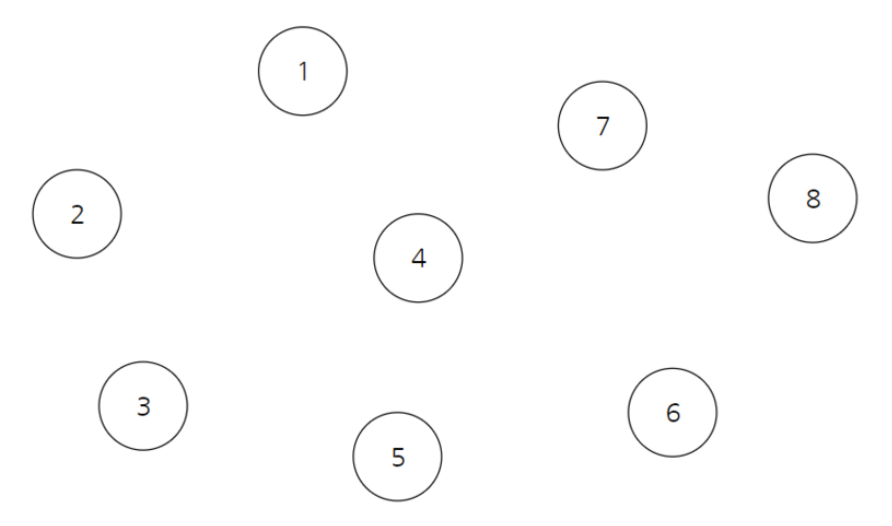
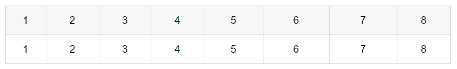
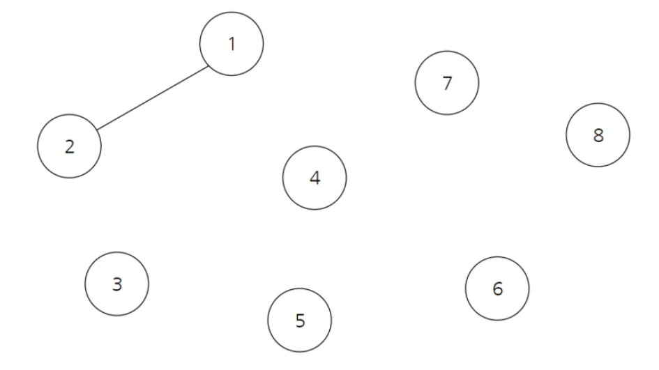
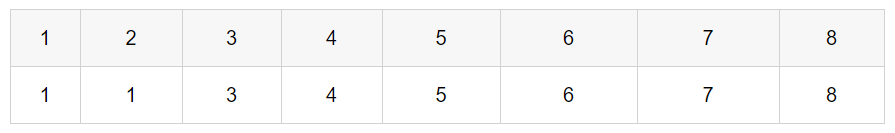
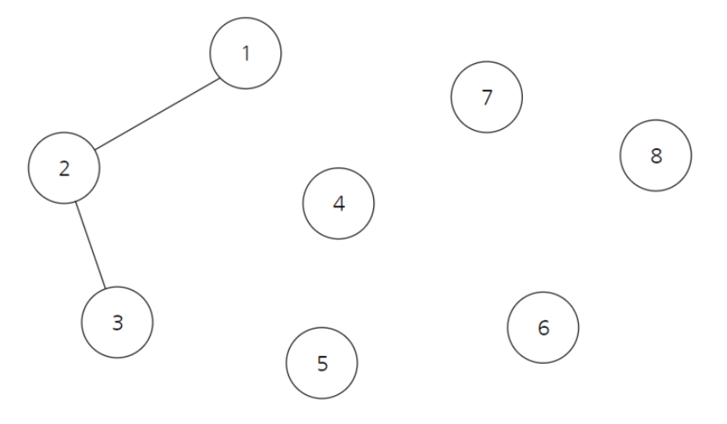
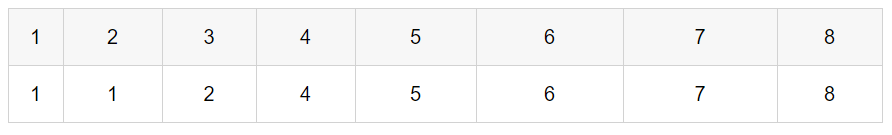
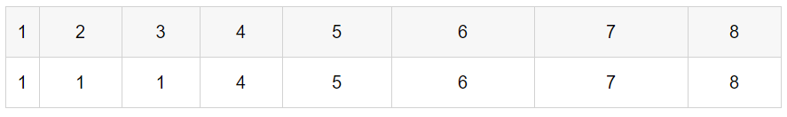

# 합집합 찾기 Union-Find

> <a src="https://youtu.be/AMByrd53PHM">실전 알고리즘 강좌 </a>


### Union-Find

- 대표적인 그래프 알고리즘
- 서로소 집합(Disjoint-Set) 알고리즘
- 여러 개의 노드가 존재할 때 두 개의 노드가 서로 같은 그래프에 속하는지 판별하는 알고리즘


###### 1. init

###### 여러 개의 노드가 자유분방하게 존재할 때, parent-table은 자기자신을 가리킨다.






###### 2. union

###### 두 노드가 연결되면 parent-table의 값을 둘 중 작은 값으로 업데이트한다.






###### 3. find

###### parent-table에서 두 노드의 부모가 같으면, 두 노드는 같은 집합에 속한다.






###### parent를 찾는 과정에서 parent-table을 업데이트 해준다.




### 소스코드

```java
public class UnionFind {

	public static int[] parent;

	public static void initParent(int cnt) {
		parent = new int[cnt+1];
		for(int i=1; i<=cnt; ++i) parent[i] = i;
	}
	
	public static int getParent(int node) {
		if(parent[node]==node) return node;
		return parent[node] = getParent(parent[node]);
	}
	
	public static void unionParent(int node1, int node2) {
		int parent1 = getParent(node1);
		int parent2 = getParent(node2);
		if(parent1<parent2) parent[parent2] = parent1;
		else parent[parent1] = parent2;
	}
	
	public static boolean findParent(int node1, int node2) {
		return getParent(node1) == getParent(node2);
	}
	
	public static void main(String[] args) {
		
		initParent(8);
		
		unionParent(1, 2);
		unionParent(2, 3);
		unionParent(3, 4);
		unionParent(5, 6);
		unionParent(6, 7);
		unionParent(7, 8);
		
		System.out.println(findParent(1,5));
		
		unionParent(4, 5);
		
		System.out.println(findParent(1,5));
		
	}
	
}
```

###### result

```
false
true
```

