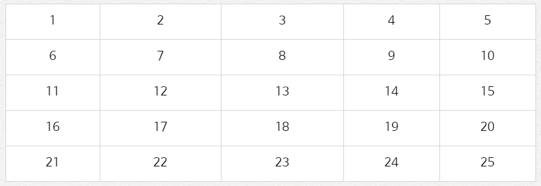
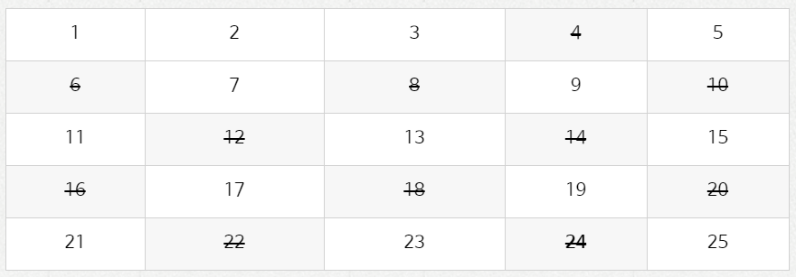
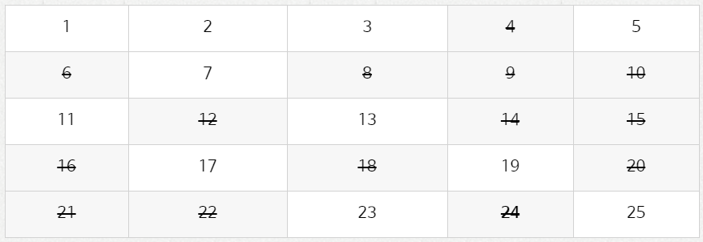
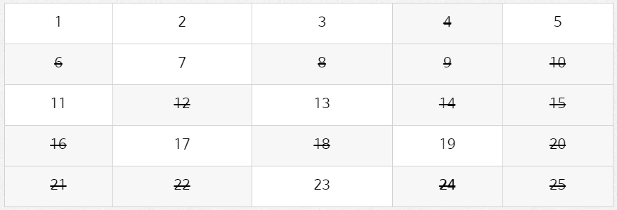

# 에라토스테네스의 체

> <a src="https://blog.naver.com/ndb796/221233595886">실전 알고리즘 강좌</a>


### 소수(Prime Number) 판별 알고리즘

- 에라토스테네스의 체는 대표적인 `소수 판별 알고리즘` 이다.
- 소수
  - 양의 약수를 두 개만 가지는 자연수
  - 2, 3, 5, 7, 11, ...
- 대량의 소수를 한꺼번에 판별하고자 할 때 사용되는 알고리즘


### 알고리즘

1. 판별할 범위(N)만큼 boolean 배열 생성.

   

2. 2부터 시작해서 해당 숫자의 배수에 해당하는 숫자를 false로 처리(자기 자신은 제외)

   

3. false인 숫자는 건너뜀.

   

4. N^(1/2)까지 반복 후, true인 인덱스만 출력.

   


### 소스코드

```java
import java.util.Arrays;

public static void main(String[] args) {
		
		int N = 25;
		
		boolean[] primeNumber = new boolean[N+1];
		Arrays.fill(primeNumber, true);
		
		for(int i=2; i<=Math.sqrt((double)N); ++i) {
			if(!primeNumber[i]) continue;
			for(int j=2; i*j<=N; ++j) primeNumber[i*j] = false;
		}
		
		for(int i=2; i<=N; ++i) {
			if(primeNumber[i]) System.out.print(i+" ");
		}
		
	}
}
```

###### result

```
2 3 5 7 11 13 17 19 23
```

